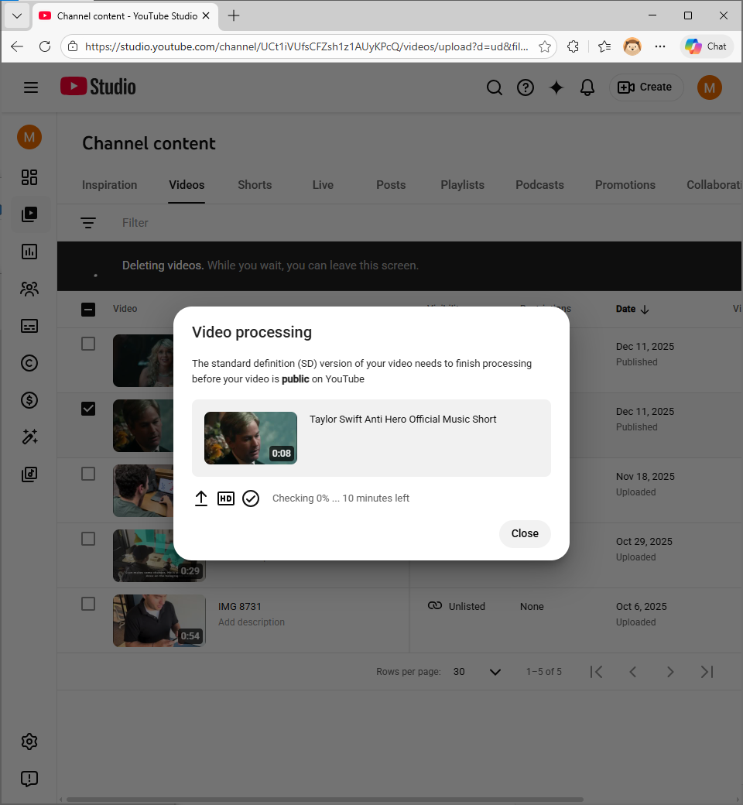
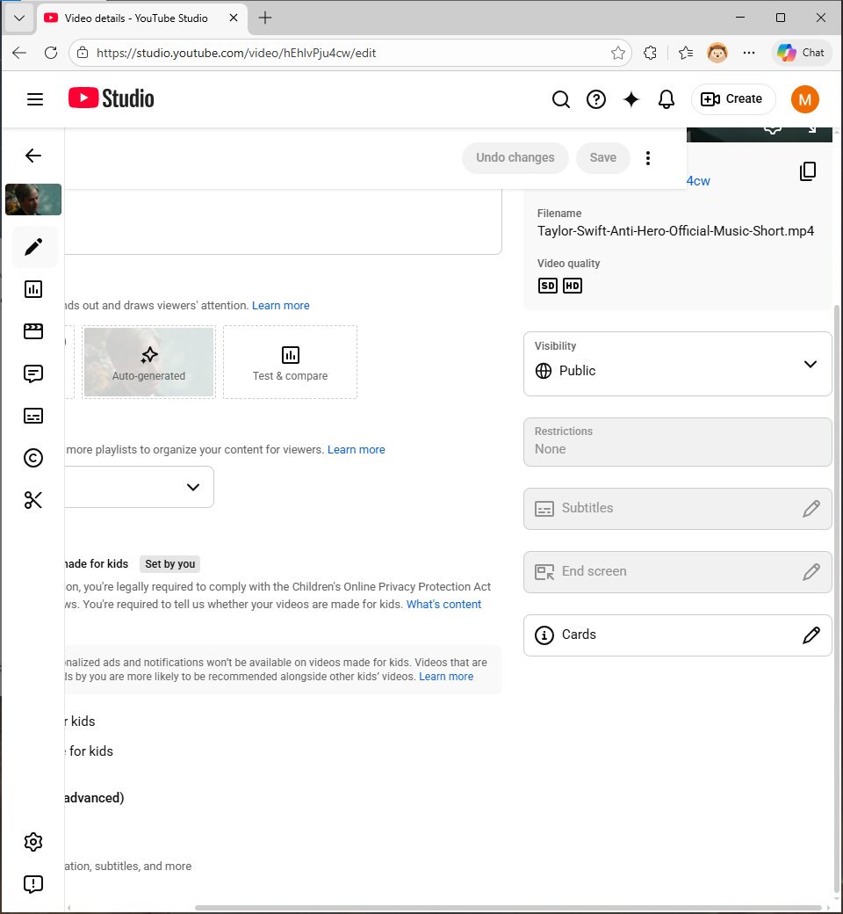
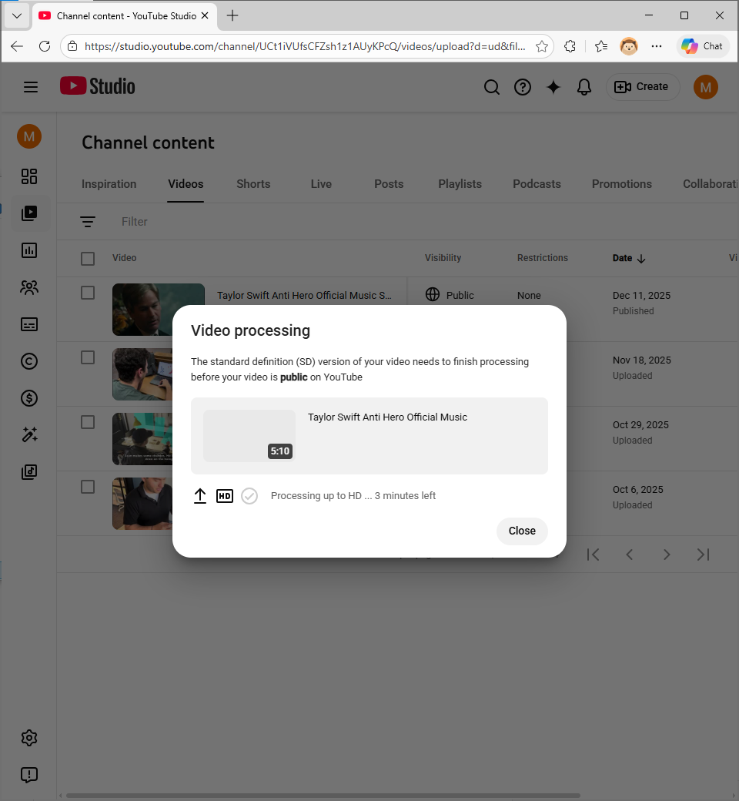
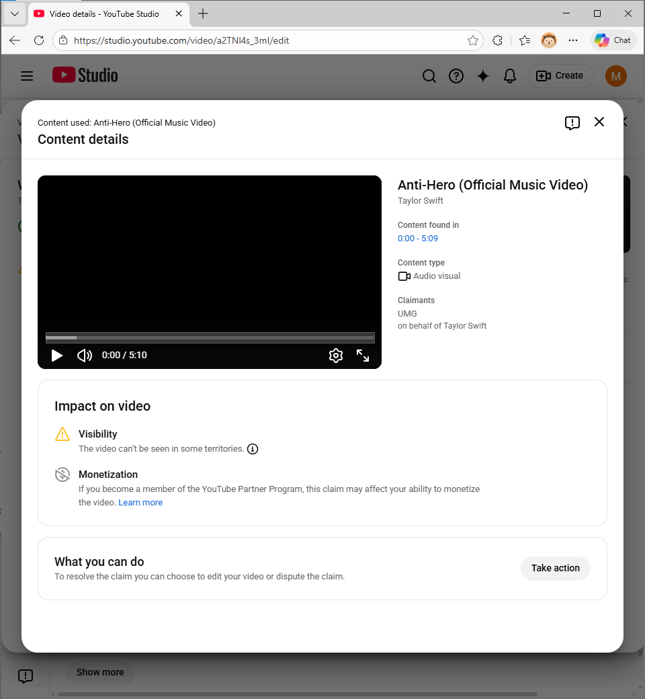
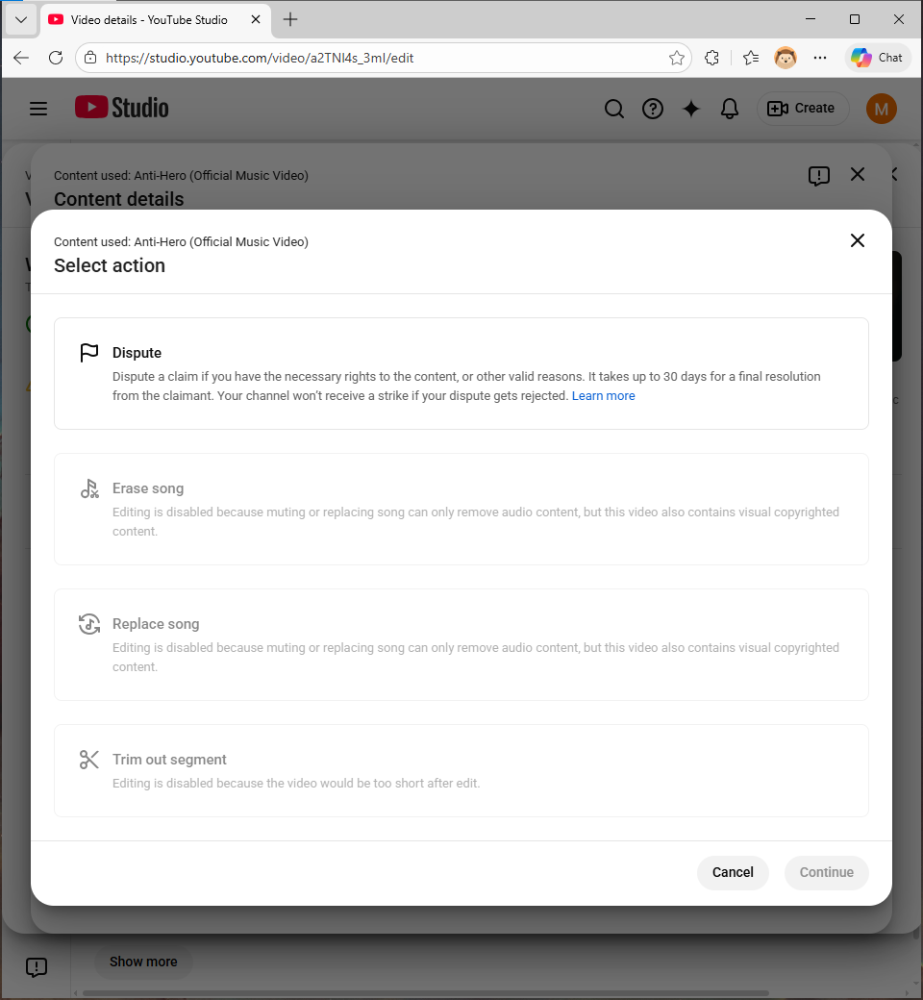
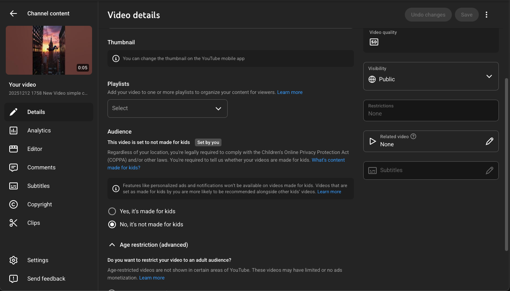
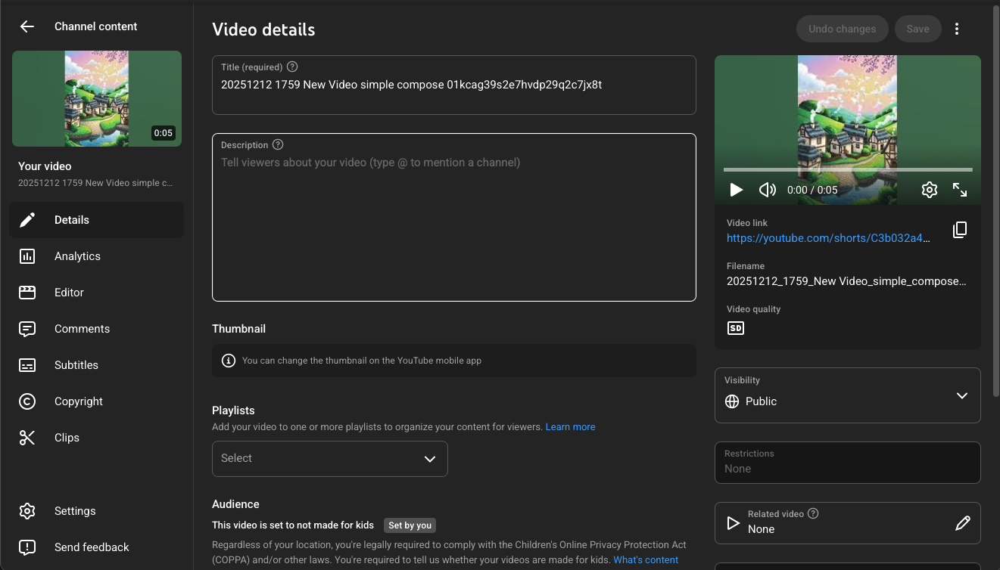
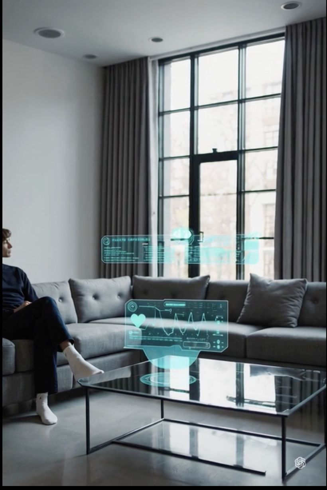
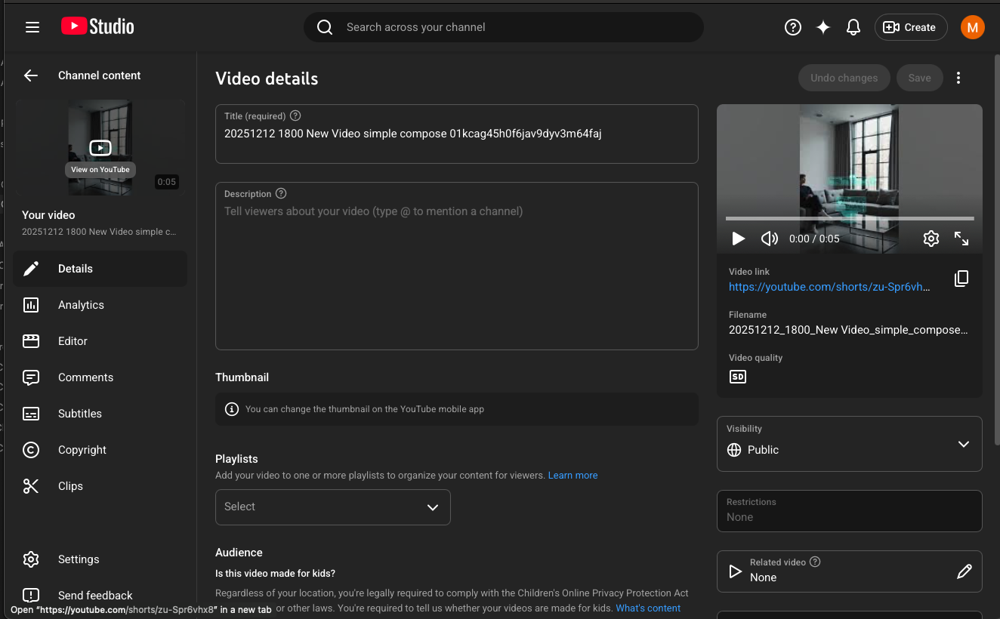

**Chosen platform: YouTube**
# Platform Analysis
YouTube operates the most mature and granular copyright enforcement system among major platforms. They combine automated content-matching (through their Content ID system), human-driven DMCA requests, and internal creator-level dispute tools. These mechanisms leverage automated and manual copyright detection tools. 
## Content ID
YouTube primarily uses the Content ID system to enforce copyright. It performs audio and video fingerprinting on every upload and compares it to a database built from reference files supplied by major rights holders (studios, labels, networks, etc.). It scans every upload automatically and fingerprints both audio and visual components. This fingerprint is then compared against their database that contains assets that represent copyrighted properties. After encountering a match, the rightsholder's preset policy (monetize, block worldwide/regionwide, or track analytics only). If the rightsholder elects to monetize, the video will remain up but some (or all) revenue will be directed to the rightsholder. They can also block the video worldwide or only in selected regions. They also may only track analytics if they do not wish to take action. This system is not accessible to most individuals. Participants in the program must show a demonstrated ownership of a substantial catalog, exclusive rights to the material, and an internal infrastructure. This means that most creators interact with the Content ID system indirectly via distributors or networks.

Creators may dispute automated claims on YouTube's platform based on: fair use, license/permission, public domain, or misidentification. The claimant reviews the dispute and may release the claim or reinstate the claim. If they desire, they may convert he claim into a DMCA takedown. For the duration of the dispute, ad revenue is held in escrow.

These claims do not imply legal liability or a DMCA strike; they are a platform-level rights-management action.
## Copyright Match Tool
This tool finds near-duplicate reuploads of a creator's own content. It is separate from Content Id and used to find mirrored or stolen videos. 
## DMCA Takedowns
Manual copyright removal requests (DMCA takedowns) are made by any rightsholder and YouTube must comply under the law. The offending video is immediately removed and a copyright strike is applied. Copyright strikes carry severe penalties and may accumulate over a 90 day period. Three strikes can lead to channel termination and other penalties. 

If a takedown leads to a strike, a creator may file a counter-notification asserting lawful use. This initiates a legal process mediated by YouTube that starts with a sworn statement with real contact information that is then sent to the claimant. If the claimant does not file a federal lawsuit within the statutory period, YouTube may restore the video and remove the strike. A DMCA takedown exposes the uploader to real-world legal risk and is treated very differently from platform-internal disputes.
## Enforcement in Practice
YouTube’s stated copyright policy emphasizes adherence to copyright law through Content ID enforcement, fair use considerations, and dispute mechanisms, suggesting a balanced evaluation of user rights and rightsholder interests. However, the experiments in Tasks 2 and 3 show that actual enforcement is driven primarily by detectability and market substitution rather than a true fair use analysis. The 7.5-second clip was allowed not because YouTube affirmatively deemed it fair use, but likely because it did not trigger Content ID, while the full-length music video was immediately restricted due to a near-perfect fingerprint match and clear substitution risk. Similarly, AI-generated videos referencing copyrighted characters or styles were permitted because they contained no matching copyrighted audio or video, despite potentially raising derivative-use concerns. This gap demonstrates that YouTube functions less as an adjudicator of copyright law and more as a risk-management system that prioritizes automated detection and financial implications over doctrinal precision.
# Fair Use Experiments
Used copyrighted material (Taylor Swift song) obtained from her channel. Both clips were from the official music video of her song "Anti-Hero" to test whether the Content ID system catches it. The first clip was 7.5 seconds long and directly cut from the video. It passed all content checks and was uploaded. It is still accessible. The second clip, the full music video, was flagged (presumably) by the Content ID system. It is still publicly accessible but is restricted in certain regions and I (presumably) cannot gain revenue off of it. 
# AI-Generated Content
Platform used: Sora
## Direct Reference
**Prompt:** Create a cinematic video of Spider-Man swinging through New York City at sunset.

Note a small annotation was made to the prompt saying the following: "Part of this text was rewritten before being used to generate the video. Click to see our policies."

As shown above, YouTube took no action against this content.
## Style Mimicry
**Prompt:** Create a hand-painted, whimsical animated video of a quiet countryside village in the style of Studio Ghibli.

As shown above, YouTube took no action against this content.
## Original Creation
**Prompt:** Create a realistic short video of a future home where AI-powered diagnostic devices analyze a person’s health in real time.

As shown above, YouTube took no action against this content.
## Findings
OpenAI’s Terms of Service for Sora state that users own the AI-generated video content they create, provided it complies with platform policies, while OpenAI retains a limited, non-exclusive license to use the content for purposes such as model improvement and safety. However, the terms prohibit generating content that is substantially similar to copyrighted works, including identifiable characters or scenes. From a legal standpoint, ownership of AI-generated content is nuanced: although users are granted contractual ownership, U.S. copyright law generally requires meaningful human creative input for a work to be copyrightable, meaning purely AI-generated content may not receive copyright protection. There is generally no automatic ownership right in outputs solely because a work was in training data; disputes are still being litigated. Platform policy allows AI-generated video but restricts impersonation, copyright infringement, and deceptive use, with enforcement becoming stricter as content moves from original creation to style mimicry and, most strictly, to direct references to protected intellectual property.
# Legal Analysis
## First Fair Use Experiment
**Purpose and Character of the Use:**  
The 7.5-second clip was used for testing and analytical purposes rather than for entertainment or commercial exploitation, which weighs in favor of fair use. The clip was removed from its original narrative context and functioned as a fragment rather than a substitute for the original music video. Although not highly transformative in the expressive sense, its limited scope and non-commercial purpose support a fair use finding.

**Nature of the Copyrighted Work:**  
The source material is a highly creative, expressive work, which weighs against fair use. However, courts have often treated this factor as secondary when the use is limited and does not threaten the market for the original work.

**Amount and Substantiality Used:**  
Only a small portion of the song and video was used, and the excerpt did not capture the “heart” of the work. This strongly favors fair use and likely explains why YouTube’s Content ID system did not detect or act on the upload.

**Effect on the Market for the Original:**  
The short clip poses minimal risk of substituting for the original music video or affecting its market value. Viewers would still need to access the official video to experience the full work, which weighs strongly in favor of fair use.
## Second Fair Use Experiment
**Purpose and Character of the Use:**  
Uploading the full music video involved no transformation and reproduced the work in its original form. Even if the purpose was experimental rather than commercial, the lack of transformation weighs heavily against fair use. The Content ID system treated the upload as a replacement for the original work.

**Nature of the Copyrighted Work:**  
As with the short clip, the work is highly creative, which weighs against fair use and reinforces the rights holder’s interest in control and monetization.

**Amount and Substantiality Used:**  
The entire copyrighted work was used, including its most recognizable and valuable elements. Courts routinely view full reproduction as strongly disfavoring fair use, particularly when no transformation is present.

**Effect on the Market for the Original:**  
The full upload directly competes with the official music video and poses a clear risk of market substitution. YouTube’s decision to restrict availability and divert monetization reflects this concern and aligns with established copyright doctrine.
## Case Law
The outcomes of these experiments align with, but also simplify, the principles articulated in major fair use cases. In _Google LLC v. Oracle America, Inc._, the Supreme Court emphasized the importance of transformative purpose and the absence of meaningful market substitution, even where the copied material was creative and copied in substantial quantity. This reasoning supports YouTube’s tolerance of the 7.5-second clip, which posed negligible market harm and did not function as a replacement for the original work. By contrast, the full-length upload directly substituted for the official music video, placing it outside the protective logic of _Google v. Oracle_.

Similarly, _Sega Enterprises Ltd. v. Accolade, Inc._ illustrates judicial willingness to allow limited copying when it enables innovation or a different functional purpose. While the short clip was not used for reverse engineering, the case supports the broader principle that non-substitutive, context-limited copying may be permissible. YouTube’s Content ID system appears to operationalize this principle in a simplified manner by focusing on detectability and substitution risk rather than expressive transformation. Notably, these cases also highlight a divergence between court-driven fair use analysis and platform enforcement, as YouTube does not attempt a full four-factor evaluation but instead relies on automated similarity thresholds and rightsholder preferences.
# Gap Analysis
A substantial gap exists between copyright law as articulated by courts, YouTube’s stated copyright policies, and actual enforcement outcomes. Legally, fair use is a fact-intensive, post hoc determination made by courts that weigh all four statutory factors together, with no single factor being dispositive. YouTube’s policy acknowledges this framework and provides dispute and counter-notification mechanisms that reference fair use doctrine. However, in practice, enforcement is driven primarily by Content ID’s automated fingerprinting, which does not evaluate purpose, transformation, or educational intent.

This gap is most evident in the treatment of the two experiments. The short clip was allowed not because YouTube affirmatively determined it to be fair use, but because it likely fell below Content ID’s detection or enforcement thresholds. The full-length video, by contrast, triggered immediate restrictions not due to a judicial finding of infringement, but because the system identified a near-perfect match and applied the rightsholder’s preset policy. In effect, YouTube enforces copyright through a risk-management and market-harm lens, privileging economic substitution and detectability over doctrinal nuance. As a result, users experience enforcement outcomes that only partially align with copyright law, with platforms acting as private regulators that narrow the practical scope of fair use beyond what courts might allow.
# Appendix
## First Fair Use Experiment
Available [here](https://www.youtube.com/watch?v=hEhlvPju4cw); uploaded December 11, 2025 at 5:55 PM CST; not detected/flagged

## Second Fair Use Experiment
Available [here](https://www.youtube.com/watch?v=a2TNl4s_3mI); uploaded December 11, 2025 at 5:54 PM CST; flagged immediately

## First AI Generated Content
Available [here](https://youtube.com/shorts/3Xk12zLHmOw); Uploaded December 12, 2025 at 6:17 PM CST; not flagged

## Second AI Generated Content
Available [here](https://youtube.com/shorts/C3b032a4tDU); uploaded December 12, 2025 at 6:15 PM CST; not flagged

## Third AI Generated Content
Available [here](https://youtube.com/shorts/zu-Spr6vhx8); uploaded December 12, 2025 at 6:17 PM CST; not flagged

